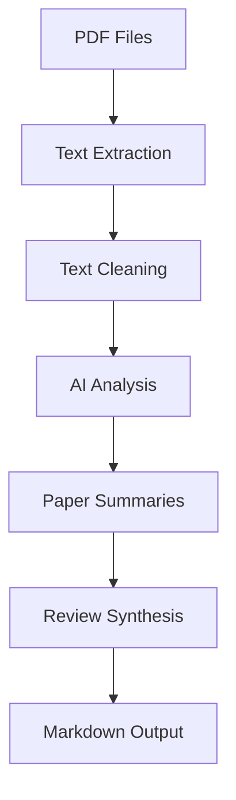

# Technical Documentation

This document provides a detailed technical overview of the AI Literature Review Generator's code structure and implementation.

## Code Structure

### Core Components

1. **Configuration Classes**
```python
class ProviderType(str, Enum):
    OPENAI = "openai"
    GEMINI = "gemini"

class OpenAIConfig(BaseModel):
    api_key: str
    model: str
    base_url: Optional[str]
    max_tokens: int
    temperature: float

class GeminiConfig(BaseModel):
    api_key: str
    model: str
    temperature: float
    max_output_tokens: int

class ModelConfig(BaseModel):
    openai: OpenAIConfig
    gemini: GeminiConfig
```
These classes handle configuration management using Pydantic for type safety and validation.

2. **Data Model**
```python
class PaperSummary(BaseModel):
    title: str
    authors: List[str]
    year: int
    research_question: str
    theoretical_framework: str
    methodology: str
    main_arguments: List[str]
    findings: str
    significance: str
    limitations: str
    future_research: str
    model_used: str
```
Represents the structured format for paper summaries using Pydantic for data validation.

### Main Functions

1. **PDF Processing Pipeline**
```
extract_text_from_pdf() → process_pdf() → analyze_pdf() → synthesize_reviews()
```

#### Text Extraction
```python
def extract_text_from_pdf(pdf_path: str) -> str:
    """
    - Opens PDF file using PyPDF2
    - Extracts text content from each page
    - Cleans and normalizes text
    - Returns concatenated text
    """
```

#### Text Analysis
```python
def analyze_pdf(text: str, filename: str, provider: ProviderType, text_limit: int) -> PaperSummary:
    """
    - Takes extracted text and metadata
    - Limits text to specified character count
    - Sends to selected AI provider
    - Parses response into PaperSummary
    - Includes fallback mechanism
    """
```

#### Review Synthesis
```python
def synthesize_reviews(summaries: List[PaperSummary], provider: ProviderType) -> str:
    """
    - Takes list of paper summaries
    - Generates comprehensive literature review
    - Structures content into sections
    - Handles provider-specific formatting
    """
```

### Helper Functions

1. **Text Processing**
```python
def clean_text(text: str) -> str:
    """
    - Normalizes Unicode characters
    - Removes non-printable characters
    - Standardizes whitespace
    - Returns cleaned text
    """
```

2. **Citation Generation**
```python
def create_apa_citation(summary: PaperSummary) -> str:
    """
    - Formats author names
    - Handles various author combinations
    - Applies APA 7th edition rules
    - Returns formatted citation
    """
```

### Error Handling and Retry Logic

1. **Retry Decorator**
```python
@retry(
    stop=stop_after_attempt(3),
    wait=wait_random_exponential(min=1, max=60)
)
```
Applied to API calls for resilience:
- Maximum 3 attempts
- Exponential backoff with randomization
- Wait time between 1-60 seconds

2. **Provider Fallback**
```python
try:
    # Primary provider attempt
except Exception:
    if provider == ProviderType.OPENAI:
        # Fallback to Gemini
```

### Parallel Processing

1. **ThreadPoolExecutor Implementation**
```python
with ThreadPoolExecutor(max_workers=4) as executor:
    futures = [executor.submit(process_pdf, path, provider, text_limit) for path in paths]
    for future in as_completed(futures):
        # Process results
```
- Processes multiple PDFs concurrently
- Default 4 worker threads
- Progress tracking with tqdm

## Data Flow



### Input Processing
1. PDF files read from `PDF` directory
2. Text extracted and cleaned
3. Text split into manageable chunks

### AI Processing
1. Text chunks sent to AI provider
2. Structured summaries generated
3. Summaries validated against PaperSummary model

### Output Generation
1. Summaries combined for synthesis
2. Literature review generated
3. Citations created
4. Results written to markdown file

## Configuration Management

### Environment Variables
- Loaded using python-dotenv
- Provides default values
- Supports multiple provider configurations

### Command-line Arguments
- Override environment variables
- Runtime configuration
- Provider selection
- Model parameters

## Provider Integration

### OpenAI Integration
```python
openai_client = openai.OpenAI(
    api_key=config.openai.api_key,
    base_url=config.openai.base_url
)
```
- Supports custom endpoints
- JSON response format
- Token limit handling

### Gemini Integration
```python
genai.configure(api_key=config.gemini.api_key)
gemini_client = genai.GenerativeModel(
    model_name=config.gemini.model,
    generation_config={...}
)
```
- Generation configuration
- Response parsing
- Error handling

## Performance Considerations

### Memory Management
- PDF text extracted page by page
- Text chunks limited by character count
- Parallel processing with thread pool

### API Optimization
- Retry mechanism for transient failures
- Provider fallback for reliability
- Configurable token limits

### Scalability
- Concurrent PDF processing
- Configurable worker threads
- Memory-efficient text handling

## Testing and Debugging

### Logging
```python
logging.basicConfig(
    level=logging.INFO,
    format='%(asctime)s - %(levelname)s - %(message)s'
)
```
- Detailed error messages
- Processing progress tracking
- API interaction logging

### Error Handling
- PDF extraction errors
- API communication errors
- Response parsing errors
- Configuration validation

## Future Improvements

1. **Potential Enhancements**
   - Additional AI providers
   - OCR support for scanned PDFs
   - Custom output formats
   - Citation style options

2. **Performance Optimizations**
   - Caching mechanisms
   - Batch processing
   - Response streaming

3. **Feature Additions**
   - Reference management
   - Multiple review styles
   - Export formats
   - Progress saving

## Dependencies

### Core Libraries
- `openai`: OpenAI API client
- `google-generative-ai`: Google Gemini API
- `PyPDF2`: PDF processing
- `pydantic`: Data validation
- `python-dotenv`: Configuration
- `tqdm`: Progress tracking
- `tenacity`: Retry logic

### Version Requirements
- Python 3.8+
- Latest stable versions of dependencies
- Backward compatibility considerations 